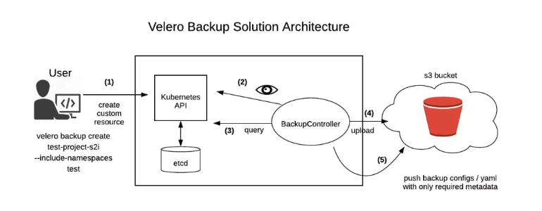
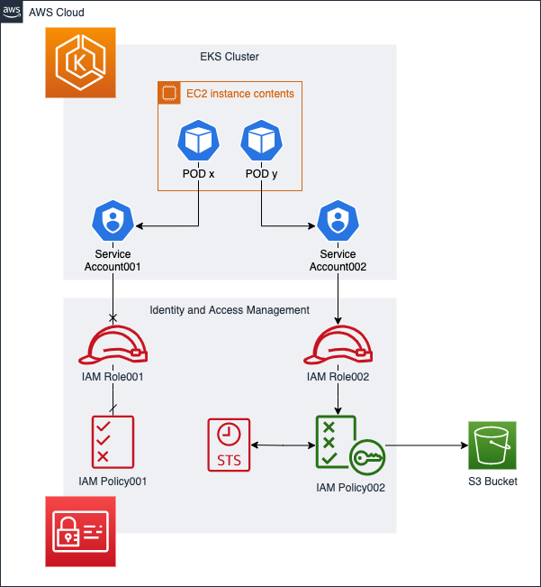

### Velero  

#### [Instalacion](https://velero.io/docs/v1.6/basic-install/)  
- osx  
`brew install velero`  
- linux  
```
Descargar la ultima version
wget https://github.com/vmware-tanzu/velero/releases/tag/v1.6.2
tar -xvf <RELEASE-TARBALL-NAME>.tar.gz
Extraer el binario hacia el PATH /usr/local/bin
```  
- Windows - Chocolatey  
`choco install velero`  

#### Instalacion velero  
  

crear bucket para respaldar velero:
```
aws s3 mb s3://<S3_BUCKET_NAME> --region eu-central-1 --profile cerouno
aws s3api get-bucket-location --bucket <S3_BUCKET_NAME>
```  

Creacion de politica para S3  
```
cat > velero-policy.json <<EOF
{
    "Version": "2012-10-17",
    "Statement": [
        {
            "Effect": "Allow",
            "Action": [
                "ec2:DescribeVolumes",
                "ec2:DescribeSnapshots",
                "ec2:CreateTags",
                "ec2:CreateVolume",
                "ec2:CreateSnapshot",
                "ec2:DeleteSnapshot"
            ],
            "Resource": "*"
        },
        {
            "Effect": "Allow",
            "Action": [
                "s3:GetObject",
                "s3:DeleteObject",
                "s3:PutObject",
                "s3:AbortMultipartUpload",
                "s3:ListMultipartUploadParts"
            ],
            "Resource": [
                "arn:aws:s3:::<S3_BUCKET_NAME>/*"
            ]
        },
        {
            "Effect": "Allow",
            "Action": [
                "s3:ListBucket"
            ],
            "Resource": [
                "arn:aws:s3:::<S3_BUCKET_NAME>"
            ]
        }
    ]
}
EOF

aws iam create-policy \
  --policy-name VeleroBackupPolicy \
  --policy-document file://velero-policy.json \
  --profile <AWS_PROFILE>
```

#### Crear IRSA  
  
```
eksctl utils associate-iam-oidc-provider --cluster=<clusterName>
eksctl create iamserviceaccount --cluster=<clusterName> --name=veleros3 --namespace=velero --attach-policy-arn=<policyARN>
```  

#### Instalacion Velero  
```
Agregar los siguientes valores a la configuracion
configuration:
  provider: aws
  backupStorageLocation:
    bucket: S3_BUCKET_NAME
serviceAccount:
  server:
    create: false
    name: veleros3


kubectl create namespace velero
helm repo add vmware-tanzu https://vmware-tanzu.github.io/helm-charts
helm upgrade --install velero vmware-tanzu/velero \
  --namespace $NAMESPACE \
  -f values.yaml
# Verificar la instalacion
kubectl get all -n velero
```
